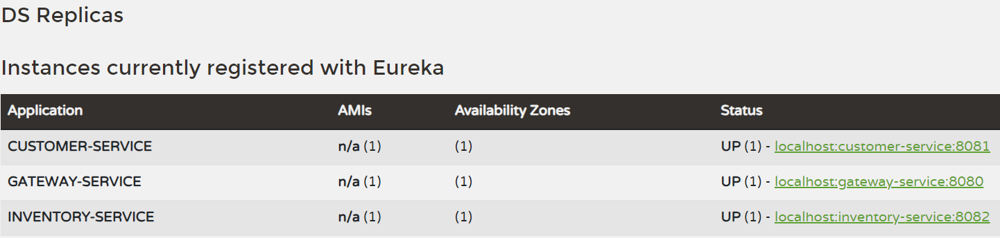

# 1.Créer le micro-service customer-service qui permet de gérer les client

# 2.Créer le micro-service inventory-service qui permet de gérer les produits

# 3. Créer la Gateway Spring cloud Gateway

# 4. Configuration statique du système de routage

### Version yaml:

### Version Class Java:

### Result

#### Customers:

#### Products:

# 5. Créer l'annuaire Eureka Discrovery Service

# 6. Faire une configuration dynamique des routes de la gateway

